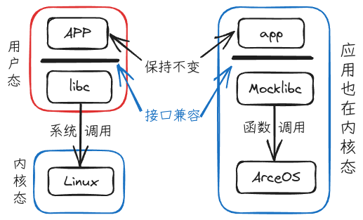

# ArceOS 支持 ELF 文件运行

项目链接：[https://github.com/lkmodel/arceos](https://github.com/lkmodel/arceos)

## 项目安排

### 整体目标

目标：在ArceOS Unikernel形态下，支持加载和运行原始的Linux应用。通过把系统调用转为函数调用，提升系统的整体运行效率；代价是降低了安全性。

核心问题：Linux应用假定自己将运行在Linux环境中，它本身以及依赖库以及工具链都遵循这一假定；现在我们要把应用放到ArceOS之上运行，让应用觉察不到自己的运行环境变化了；所以就需要ArceOS制造出这么一种运行环境。采取的方案是保持libc接口兼容前提下替换libc的实现。



### 后续工作总体规划

1. 完成规划的全部5个阶段，实现Unikernel模式下直接运行Linux的原始应用，通过系统调用转函数调用，达到提升效率的目标。
   + ~~阶段1：支持基于musl静态链接的单应用。应用虽然需要重新编译和链接，但是源码不需要修改。~~
   + 阶段2：支持基于musl动态链接的单应用。原始的二进制应用不需要修改，能够直接运行。
   + 阶段3：支持基于多地址空间从而支持多应用。通过支持`fork`，可以启动其它进程。
   + 阶段4：支持`procfs`和`sysfs`等文件系统。通过支持BusyBox、LTP等测试用例，扩大系统调用支持范围。
   + 阶段5：支持编译应用的工具链从musl到gcc。扩大对常见Linux应用的支持。
2. 优化构建过程，能够体现出当前的组件化内核构建方法相对传统方法的便捷性。

注：其中核心组件来自ArceOS公共组件，仅增加少量面向本场景组件。
## 整体架构

主要函数是`load_elf()`，它负责整个ELF文件的加载过程，根据程序类型分为两个加载路径:`load_exec()`和`load_dyn()`，包含辅助函数如`load_segment()`和`modify_plt()`用于具体的加载和修改操作。

### load_elf() 函数的主要流程:

+ 读取ELF文件大小
+ 解析ELF头部
+ 检测是否需要INTERP
+ 根据是否存在INTERP段选择不同的加载方式
+ 返回程序入口点地址

### PIE检测机制:
+ 通过检查程序头(Program Headers)中是否存在PT_INTERP段来判断
+ 如果存在PT_INTERP段,则认为是PIE程序
+ 这影响了后续的加载方式和入口点地址计算

### 两种加载方式:

a) 静态加载 (load_exec):

+ 针对静态链接的程序
+ 主要加载.text段到指定内存区域
+ 直接使用ELF头中的入口点地址

b) 动态加载 (load_dyn):
+ 针对动态链接的程序
+ 加载所有PT_LOAD类型的段
+ 需要处理PLT(Procedure Linkage Table)重定位
+ 入口点需要加上基地址偏移

### PLT修改机制:
+ 解析动态符号表和字符串表
+ 处理.rela.plt重定位段
+ 将外部函数地址填入PLT表中

## 编译运行

### 安装Python环境

首先，验证本地是否已安装Python环境

``` bash
 ~ ❯ which python
/usr/bin/python
 ~ ❯ which python3
/usr/bin/python3
```

如果没有输出结果，说明系统未安装 Python 环境。以 Ubuntu 为例，可以使用以下命令安装：

``` bash
sudo apt-get update
sudo apt-get install python3
```

安装完成后，再次运行上述命令，验证是否已经成功安装 Python 环境。

### 安装musl交叉编译环境

参考链接：[https://github.com/richfelker/musl-cross-make.git](https://github.com/richfelker/musl-cross-make.git)

``` bash
git clone https://github.com/richfelker/musl-cross-make.git
cd ./musl-cross-make
cp ./config.mak.list ./config.mak
printf "TARGET = riscv64-linux-musl\nOUTPUT = /opt/musl_riscv64\n" >> config.mak
sed -i '15i\riscv64-linux-musl' config.mak
sed -i '22i\OUTPUT = /opt/musl_riscv64' config.mak
make
sudo make install

export PATH=$PATH:/opt/musl_riscv64/bin
```

注：该部分已经包含到`linux_abi.sh`中，方法不限，如已安装可略过

### 尝试运行

``` bash
git clone https://github.com/lkmodel/arceos.git
cd arceos
git switch mocklibc
./linux_abi.sh
```

对于`linux_abi.sh`文件

可用参数:
+ `ARCH`: 目标架构: x86_64, riscv64, aarch64, 目前仅支持riscv64
+ `LOG`: 日志等级: warn, error, info, debug, trace, 默认为warn
+ `QEMU_LOG`: 是否开启QMEU日志 (日志文件为 "qemu.log"), 默认为no
+ `TTYPE`: 运行测试类型：static, dynamic, all, 默认为all

`linux_abi.sh`的内容也可根据情况进行自行调整

## 协作开发流程

在参与项目协作时，请按照以下步骤进行操作：

1. Fork 和 Clone 仓库
  首先，Fork [中心仓库](https://github.com/lkmodel/arceos)到自己的 GitHub 账号下，并 Clone 到本地环境。在后续开发中，基于 mocklibc 分支进行协作，所有的 Pull Request（PR）和合并操作都将在该分支上进行。

2. 提出想法并讨论（建议）
  在正式实现前，可以在项目 1 的微信群中提出自己的想法，与其他开发者进行讨论或协商，以确保思路清晰并避免重复开发。

3. 本地实现与测试
  根据讨论结果，在本地进行功能的开发与实现，并确保经过充分的本地测试，确保代码质量和功能的正确性。

4. 同步中心仓库并解决冲突
   在提交 PR 之前，确保自己的 Fork 仓库与中心仓库保持同步。可以通过以下步骤实现：
   + 从中心仓库拉取最新代码，并在本地进行 Rebase：

      ``` bash
      git pull --rebase
      ```

   + 如果存在冲突，解决冲突并重新测试代码。

5. 推送到 Fork 仓库并提交 PR
   将修改后的代码推送到自己 Fork 的仓库：

   ``` bash
   git push
   ```

   随后，在GitHub上提交 Pull Request 到中心仓库的 mocklibc 分支，并等待代码审查和合并。

确保协作开发的有序性和代码库的一致性。

## 重点工作内容

（1）扩大动态链接应用的支持范围，后面不再单独关注静态应用
（2）优化内部实现，包括简化代码，提升效率，简化构建脚本等等
（3）完善CI测试等，尤其支持新特性要先加上测试
（4）对各种bug的fix
（5）尽量复用arceos的现有组件
（6）手册与文档的完善
